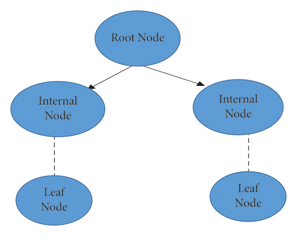
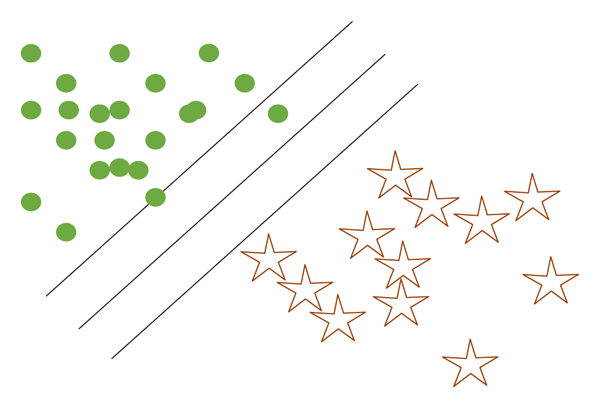
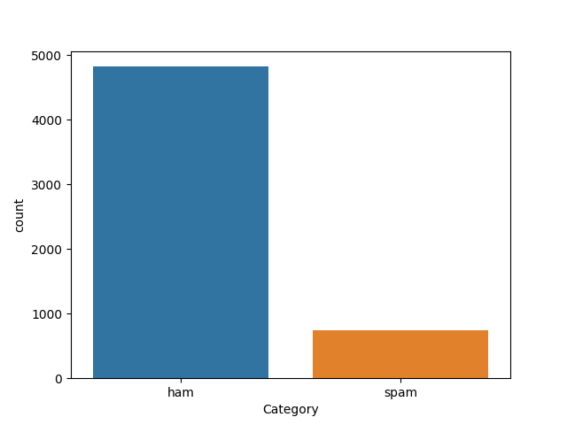
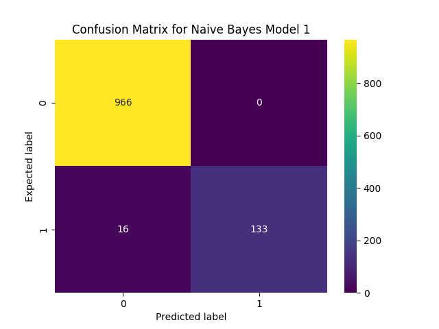
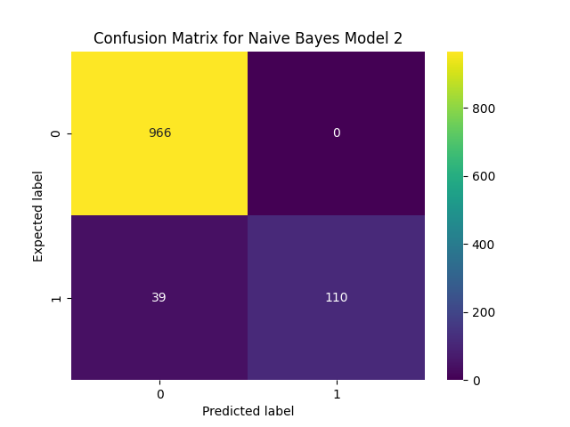
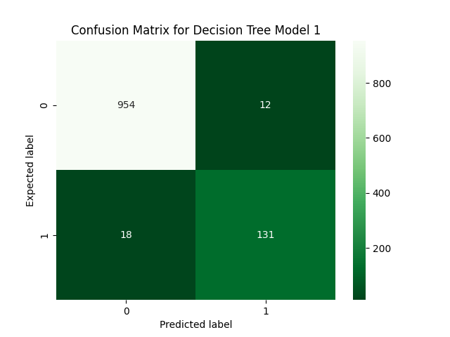
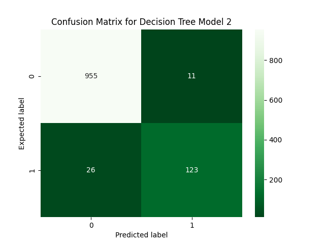
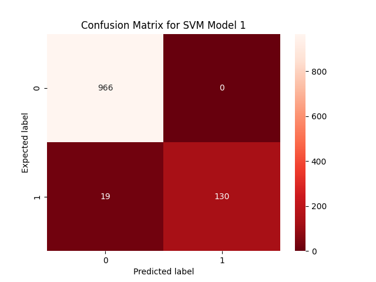
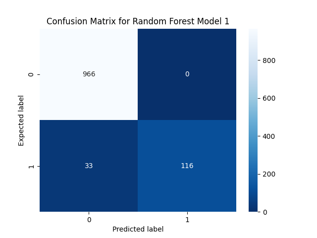

# Spam Email Detection
Machine Learning Techniques For Spam Email Detection with Python.


### Abstract
* In this, we build a spam detector using 4 Machine Learning models and evaluate them with test data using different performance metrics used.


* While spam emails are sometimes sent manually by a human, most often, they are sent using a bot. Most popular email platforms, like Gmail and Microsoft Outlook, automatically filter spam emails by screening for recognizable phrases and patterns. A few common spam emails include fake advertisements, chain emails, and impersonation attempts. While these built-in spam detectors are usually pretty effective, sometimes, a particularly well-disguised spam email may fall through the cracks, landing in your inbox instead of your spam folder.


* Spams	 can	 be	 detected	 through machine	 learning	
methodologies.	 Machine	 learning	 methods	 are	 commonly	
used	 in	 spam	 filtering.

`Spam`

* Bulk	 mails	 that	 are	 unnecessary	 and	 undesirable	 can	 be	
classified	 as	 Spam	 Mails.


* Clicking on a spam email can be dangerous, exposing your computer and personal information to different types of malware. Therefore, it’s important to implement additional safety measures to protect your device, especially when it handles sensitive information like user data.


| Categories           | Descriptions                                                 |
|----------------------|--------------------------------------------------------------|
| Health               | The spam	of	fake medications                                 |
| Promotional	products | The	spam	of	fake	fashion items	like	clothes	bags	and	watches |
| Adult	content        | The	spam	of	adult	content	of pornography	and prostitution    |
| Finance	&	marketing  | The	spam	of	stock	kiting,	tax solutions,	and	loan	packages   |
| Phishing             | The	spam	of	phishing	or fraud                                |

### Machine Learning-Based Spam Filtering Methods
### `Naïve Bayes(NB)` 

* Naïve Bayes classifiers are easy to build because they do not require any iterative process and they perform very efficiently on large datasets with a handsome level of accuracy.


* This	algorithm	is	a	supervised	learning	algorithm that  relies	on	the	Bayes	theorem.


* It assumes that the predictors are independent, which means that knowing the value of one attribute impacts any other attribute’s value.

### `Decision Trees`
* Decision tree classifier is a machine learning algorithm, which has been widely used since the last decade for classification.


* A decision tree classifier is a collection of well-defined questions about test record attributes. Each time we get an answer, a follow up question is raised until a decision is not made on the record.


* Tree-based decision algorithms define models that are constructed iteratively or recurrently based on the data provided. The decision tree-based algorithms goal is used to predict a target variable’s value on a given set of input values. This algorithm uses a tree structure to solve classification and regression problems.


Structure of a Decision Tree :



### `Support Vector Machine (SVM)`
* SVM is a formally defined discriminative supervised learning classifier that takes labeled examples for training and gives a hyperplane as output, classifying new data.
* A set of objects belonging to various class memberships are separated by decision planes.
Figure below shows the classification concept of linear support vector machines. 
* In the figure, some circles and stars are called objects. These objects can belong to any of two classes, i.e., the class of stars or dots. The isolated lines determine the choice of objects between green and brown objects. On the lower side of the plane, the objects are brown stars, and on the upper side of the plane all objects are green dots showing that two unique objects are classified into two different classes.
* If a new object black circle is given to the model, it will classify that circle into one of the classes according to the training examples provided in the training phase.

Support vector machine classification :



### `Random Forest `
* Random forest is like bootstrapping algorithm with Decision tree (CART) model. Random forest tries to build multiple CART model with different sample and different initial variables.


* For instance, it will take a random sample of 100 observation and 5 randomly chosen initial variables to build a CART model. It will repeat the process (say) 10 times and then make a final prediction on each observation. Final prediction is a function of each prediction. This final prediction can simply be the mean of each prediction.


* Random forest gives much more accurate predictions when compared to simple CART/CHAID or regression models in many scenarios. These cases generally have high number of predictive variables and huge sample size. This is because it captures the variance of several input variables at the same time and enables high number of observations to participate in the prediction.

### Metrics Used
Following are the metrics we used to evaluate the performance of ML techniques:

1. [x] **Precision :**</br>
Precision refers to the closeness of two or more measurements to each other. In Machine Learning, precision is the fraction of relevant instances among the retrieved instances. Precision = TP / (TP + FP) (Where TP = True Positive, TN = True Negative, FP = False Positive, FN = False Negative).
 

2. [x] **Accuracy:** </br>
Accuracy refers to the closeness of a measured value to a standard or known value. Accuracy = (TP+TN) / ALL


3. [x] **Recall :** </br>
Recall is how many of the true positives were recalled (found), i.e. how many of the correct hits were also found. Recall = TP / (TP + FN)


4. [x]   **F-Score :** </br>
F-scores are a statistical method for determining accuracy accounting for both precision and recall. It is essentially the harmonic mean of precision and recall.


5. [x] **AUC:** </br>
AUC is the area under the ROC curve. The closer the AUC value is to 1, the better the model.


#### Importing Libraries
```commandline
import pandas as pd
import seaborn as sns
import matplotlib.pyplot as plt
import numpy as np

from texttable import Texttable
from sklearn.model_selection import train_test_split
from textblob import TextBlob
from sklearn.feature_extraction.text import CountVectorizer
from sklearn.feature_extraction.text import TfidfVectorizer

from sklearn.metrics import confusion_matrix
from sklearn.metrics import accuracy_score
from sklearn.metrics import precision_score
from sklearn.metrics import recall_score
from sklearn.metrics import f1_score
from sklearn.metrics import roc_auc_score

from sklearn.naive_bayes import MultinomialNB
from sklearn.tree import DecisionTreeClassifier
from sklearn.svm import SVC
from sklearn.ensemble import RandomForestClassifier
from tabulate import tabulate
```

#### Loading the Dataset
```
df = pd.read_csv("../Statics/spam.csv")
print(df.head(), '\n')
```

#### Adding Columns
```
df['length'] = df['Message'].map(lambda text: len(text))
df['label'] = df['Category'].map({'ham': 0, 'spam': 1})
```

Let’s visualize the distribution of Ham and Spam data:
```
sns.countplot(x=df['Category'])
plt.show()
```


---
Now, Splitting the data into training and testing parts using train_test_split() function.
```
X_train, X_test, y_train, y_test = train_test_split(df['Message'], df['Category'], test_size=0.2, random_state=42)
```
* Here we keep 20% of the data for testing and 80% is used for training model.

---
For each word in the email text, get the base form of the word and return the list of base words.
```commandline
def split_into_lemmas(message):
    message = message.lower()
    words = TextBlob(message).words
    # for each word, take its "base form" = lemma
    return [word.lemma for word in words]
```

---
#### Feature Sets & Vectorization
1. **The	feature	set	1 :**</br>
Most Frequent Word Count with Count	Vectorization.


2. **The	feature	set	2 :**</br>
Term Frequency - Inverse Document Frequency(Tf-idf) :
* This uses all the tokens in the dataset as vocabulary.Frequency of occurrence of a token from vocabulary in each document consists of the term frequency and number of documents in which token occurs determines the Inverse document frequency.


* What this ensures is that,if a token occurs frequently in a document that token will have high TF but if that token occurs frequently in majority of documents then it reduces the IDF ,so stop words like an,the,i which occur frequently are penalized and important words which contain the essence of document get a boost.Both these TF and IDF matrices for a particular document are multiplied and normalized to form TF-IDF of a document.


```commandline
def feature1(mail):
    # Get the bag of words for the mail text
    bow_transformer = CountVectorizer(analyzer=split_into_lemmas).fit(X_train)
    # print(len(bow_transformer.vocabulary_))
    messages_bow = bow_transformer.transform(mail)

    # print sparsity value
    print('sparse matrix shape:', messages_bow.shape)
    print('number of non-zeros:', messages_bow.nnz)
    print('sparsity: %.2f%%' % (100.0 * messages_bow.nnz / (messages_bow.shape[0] * messages_bow.shape[1])))
    print('\n')

    return messages_bow
```

```commandline
def feature2(mail):
    tfidf_transformer = TfidfVectorizer().fit(X_train)
    messages_tfidf = tfidf_transformer.transform(mail)
    # print sparsity value
    print('sparse matrix shape:', messages_tfidf.shape)
    print('number of non-zeros:', messages_tfidf.nnz)
    print('sparsity: %.2f%%' % (100.0 * messages_tfidf.nnz / (messages_tfidf.shape[0] * messages_tfidf.shape[1])))
    print('\n')

    # return result of transforms
    return messages_tfidf
```

---
 Transform training set features into a set of useful features to build models :
```
train_feature1 = feature1(X_train)
train_feature2 = feature2(X_train)
```
Output :
> sparse matrix shape: (4457, 7714)</br>
> number of non-zeros: 64371</br>
> sparsity: 0.19%

>sparse matrix shape: (4457, 7701)</br>
>number of non-zeros: 59275</br>
>sparsity: 0.17%


 ---
Transform test features to test the model performance :
```
test_feature1 = feature1(X_test)
test_feature2 = feature2(X_test)
```
Output :
>sparse matrix shape: (1115, 7714)</br>
>number of non-zeros: 15000</br>
>sparsity: 0.17%

>sparse matrix shape: (1115, 7701)</br>
>number of non-zeros: 13741</br>
>sparsity: 0.16%

---
#### Function which takes in y test value and y predicted value and prints the associated model performance metrics:
```
def model_assessment(y_test, predicted_class, model, color):
    confusion_matrix_results = confusion_matrix(y_test, predicted_class)
    accuracy_results = accuracy_score(y_test, predicted_class)
    precision_results = precision_score(y_test, predicted_class, pos_label='spam')
    recall_result = recall_score(y_test, predicted_class, pos_label='spam')
    f_score_results = f1_score(y_test, predicted_class, pos_label='spam')
    auc_results = roc_auc_score(np.where(y_test == 'spam', 1, 0), np.where(predicted_class == 'spam', 1, 0))

    table = Texttable()
    table.add_rows(
        [
            ["Confusion Matrix", confusion_matrix_results],
            ["", ""],
            ["Accuracy", accuracy_results],
            ["Precision", precision_results],
            ["Recall", recall_result],
            ["F-Score", f_score_results],
            ["AUC", auc_results]
        ]
    )
    table.set_deco(Texttable.VLINES | Texttable.BORDER)
    print(model.upper())
    print(table.draw())
    print('\n')

    cm = confusion_matrix(y_test, predicted_class)
    sns.heatmap(cm, fmt='g', annot=True, cmap=color)
    plt.title(f'Confusion Matrix for {model}')
    plt.ylabel('Expected label')
    plt.xlabel('Predicted label')
    plt.show()

    return confusion_matrix_results, accuracy_results, precision_results, recall_result, f_score_results, auc_results
```

---
#### Function for making Perfomance Metrics Table of All Models
```
def final_data_table(nbm, dtm, svm, rfm,num):
    headers = ["Model Name", "Naive Bayes Model", "Decision Tree Model", "SVM", "Random Forest Model"]
    rows = ["Confusion Matrix", "Accuracy", "Precision", "Recall", "F-Score", "AUC"]

    data = [[rows[i], nbm[i], dtm[i], svm[i], rfm[i]] for i in range(len(rows))]

    print(f'Comparison Table for Models with feature{num}')
    print(tabulate(data, headers=headers, tablefmt='pretty'))
```


---
1. **Naive Bayes Model**
```commandline
modelNB = MultinomialNB()  # Create and fit NB model

modelNB.fit(train_feature1, y_train)
predicted_class_NB1 = modelNB.predict(test_feature1)  # NB predictions
nbm_model1 = model_assessment(y_test, predicted_class_NB1, "Naive Bayes Model 1", "viridis")  # Assess NB

modelNB3 = modelNB.fit(train_feature2, y_train)
predicted_class_NB2 = modelNB.predict(test_feature2)  # NB predictions
nbm_model2 = model_assessment(y_test, predicted_class_NB2, "Naive Bayes Model 2", "viridis")  # Assess NB
```
Output :

| Naive Bayes      | Model 1               |
|------------------|-----------------------|
| Confusion Matrix | [[966 ,0],[ 16 ,133]] |
| Accuracy         | 0.986                 |
| Precision        | 1                     |
| Recall           | 0.893                 |
| F-Score          | 0.943                 |
| AUC              | 0.946                 |

<br>

 | Naive Bayes      | Model 2               |
|------------------|-----------------------|
| Confusion Matrix | [[966 ,0],[ 39 ,110]] |
| Accuracy         | 0.965                 |
| Precision        | 1                     |
| Recall           | 0.738                 |
| F-Score          | 0.849                 |
| AUC              | 0.869                 |





---
2. **Decision Tree Model**
```commandline
model_tree = DecisionTreeClassifier()  # Create and fit tree model

model_tree.fit(train_feature1, y_train)
predicted_class_tree1 = model_tree.predict(test_feature1)  # Run model on test and print metrics
dtm_model1 = model_assessment(y_test, predicted_class_tree1, "Decision Tree Model 1", "Greens_r")

model_tree.fit(train_feature2, y_train)
predicted_class_tree2 = model_tree.predict(test_feature2)  # Run model on test and print metrics
dtm_model2= model_assessment(y_test, predicted_class_tree2, "Decision Tree Model 2", "Greens_r")
```

Output :

 | Decision Tree    | Model 1                |
|------------------|------------------------|
| Confusion Matrix | [[954 ,12],[ 18 ,131]] |
| Accuracy         | 0.972                  |
| Precision        | 0.904                  |
| Recall           | 0.886                  |
| F-Score          | 0.895                  |
| AUC              | 0.936                  |

<br>

 | Decision Tree    | Model 2                |
|------------------|------------------------|
| Confusion Matrix | [[955 ,11],[ 26 ,123]] |
| Accuracy         | 0.967                  |
| Precision        | 0.900                  |
| Recall           | 0.846                  |
| F-Score          | 0.872                  |
| AUC              | 0.916                  |




---
3. **Support Vector Machine (SVM) Model**
4. 
```commandline
model_svm = SVC()  # Create and fit SVM model

model_svm.fit(train_feature1, y_train)
predicted_class_svm1 = model_svm.predict(test_feature1)  # Run model on test and print metrics
svm_model1 = model_assessment(y_test, predicted_class_svm1, "SVM Model 1", "Reds_r")

model_svm.fit(train_feature2, y_train)
predicted_class_svm2 = model_svm.predict(test_feature2)  # Run model on test and print metrics
svm_model2 = model_assessment(y_test, predicted_class_svm2, "SVM Model 2", "Reds_r")
```

Output :

 | SVM              | Model 1               |
|------------------|-----------------------|
| Confusion Matrix | [[966 ,0],[ 19 ,130]] |
| Accuracy         | 0.983                 |
| Precision        | 1                     |
| Recall           | 0.872                 |
| F-Score          | 0.932                 |
| AUC              | 0.936                 |

<br>

 | SVM              | Model 2               |
|------------------|-----------------------|
| Confusion Matrix | [[966 ,0],[ 12 ,137]] |
| Accuracy         | 0.989                 |
| Precision        | 1                     |
| Recall           | 0.919                 |
| F-Score          | 0.958                 |
| AUC              | 0.960                 |



---
4. **Random Forest Model**
```commandline
model_rf = RandomForestClassifier(n_estimators=20, criterion='entropy')  # Create and fit model

model_rf.fit(train_feature1, y_train)
predicted_class_rf1 = model_rf.predict(test_feature1)  # Run model on test and print metrics
rfm_model1 = model_assessment(y_test, predicted_class_rf1, "Random Forest Model 1", "Blues_r")

model_rf.fit(train_feature2, y_train)
predicted_class_rf2 = model_rf.predict(test_feature2)  # Run model on test and print metrics
rfm_model2 = model_assessment(y_test, predicted_class_rf2, "Random Forest Model 2", "Blues_r")
```

Output :

 | Random Forest    | Model 1               |
|------------------|-----------------------|
| Confusion Matrix | [[966 ,0],[ 33 ,116]] |
| Accuracy         | 0.970                 |
| Precision        | 1                     |
| Recall           | 0.772                 |
| F-Score          | 0.871                 |
| AUC              | 0.886                 |

<br>

| Random Forest    | Model 2               |
|------------------|-----------------------|
| Confusion Matrix | [[965 ,1],[ 24 ,125]] |
| Accuracy         | 0.979                 |
| Precision        | 1                     |
| Recall           | 0.846                 |
| F-Score          | 0.916                 |
| AUC              | 0.923                 |




---
#### Final Comparison Table for Models :
```commandline
final_data_table(nbm_model1, dtm_model1, svm_model1, rfm_model1, '1')
final_data_table(nbm_model2, dtm_model2, svm_model2, rfm_model2, '2')
```
Output :

* Comparison Table for Models with feature 1 :

| Model Name        |    Naive Bayes Model    |    Decision Tree Model    |           SVM           |   Random Forest Model   |
|:------------------|:-----------------------:|:-------------------------:|:-----------------------:|:-----------------------:|
| Confusion Matrix  |  [[966 ,0],[ 16 ,133]]  |  [[954 ,12],[ 18 ,131]]   |  [[966 ,0],[ 19 ,130]]  |  [[966 ,0],[ 33 ,116]]  |
| Accuracy          |   0.9856502242152466    |    0.9721973094170404     |   0.9829596412556054    |   0.9695067264573991    |
| Precision         |           1.0           |    0.9041095890410958     |           1.0           |           1.0           |
| Recall            |   0.8926174496644296    |    0.8859060402684564     |    0.87248322147651     |   0.7718120805369127    |
| F-Score           |   0.9432624113475176    |     0.894915254237288     |    0.931899641577061    |   0.8712121212121211    |
| AUC               |   0.9463087248322148    |     0.935706643322634     |    0.936241610738255    |   0.8859060402684564    |

<br>
* Comparison Table for Models with feature 2 :

| Model Name       |   Naive Bayes Model   |  Decision Tree Model   |          SVM          |  Random Forest Model  |
|:-----------------|:---------------------:|:----------------------:|:---------------------:|:---------------------:|
| Confusion Matrix | [[966 ,0],[ 39 ,110]] | [[955 ,11],[ 26 ,123]] | [[966 ,0],[ 12 ,137]] | [[965 ,1],[ 24 ,125]] |
| Accuracy         |  0.9650224215246637   |   0.9668161434977578   |   0.989237668161435   |   0.979372197309417   |
| Precision        |          1.0          |          0.9           |          1.0          |          1.0          |
| Recall           |   0.738255033557047   |   0.8456375838926175   |  0.9194630872483222   |  0.8456375838926175   |
| F-Score          |  0.8494208494208495   |   0.8719723183391003   |   0.958041958041958   |  0.9163636363636364   |
| AUC              |  0.8691275167785235   |   0.9155724151347145   |  0.9597315436241611   |  0.9228187919463087   |

---
#### Results :
* All four models deliver excellent results. (All of them have greater than 96 percent accuracy), thus comparing them might be difficult.


* We have an unbalanced dataset; most of our data points contain the label “ham,” which is natural because most SMS are ham. Accuracy cannot be an appropriate metric in certain situations. Other measurements are required.

Which metric is better?
* False negative and false positive are significant in this problem. Precision and recall are the metrics that allow us the ability to calculate them, but there is one more, ‘f1-score.’


* The f1-score is the harmonic mean of accuracy and recall. Thus, we can get both with a single shot.

Summary :
* Overall, it is clear from comparison that Naive Bayes and Decision Tree Models gives better results while using feature 1 than feature 2.


* And SVM and random Forest Models gives better results while using feature 2 than feature 1.


* But, All the Models are providing us with excellent results.

> Of course, we can employ ensemble methods to combine two or more of these models into a really good spam detector.
> <br> Code of which is given : [code](Ensembling_Models/Train.py)

